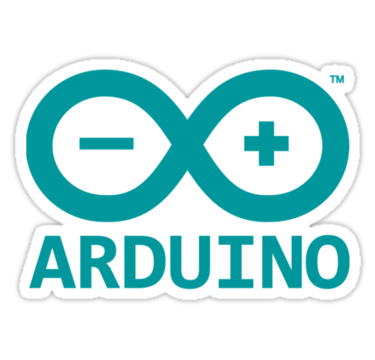
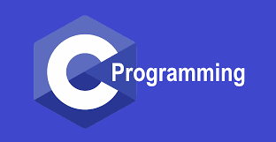
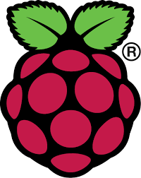

## Hola 👋, soy [JuanPy](https://medium.com/@RadIONTech)

<a href="https://discord.gg/jtYHaQ8SvF">
  
</a>


<a href="https://twitter.com/RadIONtech">
  
</a>


<br /><br />

Juan Crespo, programo por gusto.


### 👨‍💻 Me encuentro en los siguientes proyectos:
- Trabajando en ***Bot-CryptoQuant Software***
- Estudio en finanzas Quant con Python
- Escribiendo en mi ***[Blog](https://medium.com/@RadIONTech)***
- Aprendiendo cosas en Física


### 😎 Tecnologías en las que soy bueno

<code></code>
<code></code>
<code></code>
<br /><br />
<code></code>
<code></code>
<code></code>
<br /><br />
<code></code>
<code></code>
<code></code>
<code></code>

<br /><br />


### STATS


<!--START_SECTION:waka-->
```text
TeX      2 hrs 32 mins   █████████████████████████   99.51 % 
```
<!--END_SECTION:waka-->