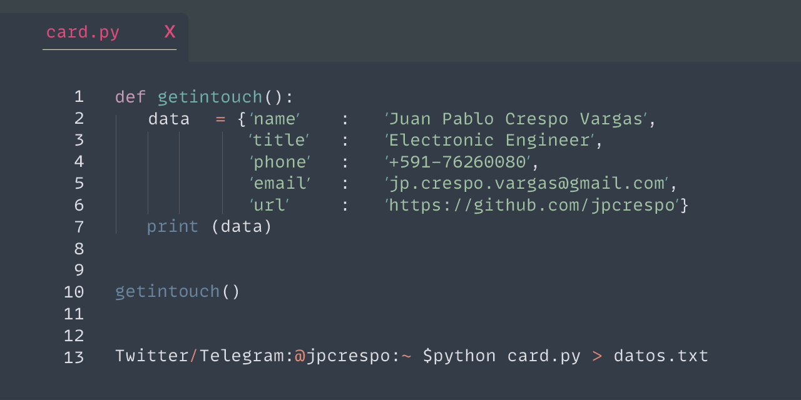

# Hola! 👋 Bienvenido a mi perfil de Github.




## Sobre Mí 📖


Mi nombre es Juan P Crespo, soy Ingeniero Electrónico apasionado por temas relacionados con ciencia y tecnológia. Tengo estudios en:

- Física en ciencias Puras
- Aplicación de radiación ionizante en medicina
- Procesamiento digital de imágenes


## Temas de Interés

- Desarrollo de Software en Python 🐍
- Estudio de sistemas complejos 🦋
- Bioinformática 🧬
- Finanzas Quant 📈📉
- Blockchain and smart contracts 💻.
- Análisis ₿ Bitcoin data
- Análisis del Sonido y procesamiento de datos
- Robots, automatizaciones y sistemas domóticos

## Experiencia en el manejo.

- Linux
- Arduino
- Raspberry
- OpenCV
- Latex
- Pandas, Numpy, Numexpr
- Geant4 
- Bots Twitter, Telegram
- C/Matlab
- Data Science
- Machine Learning
- Digital Brain and knowledge management 
- Matplotlib, gnuplot. 

## Artículos de interés y opinión.

- ESTUDIO DEL METODO MONTE CARLO EN SIMULACIONES PARA LA ESTIMACION DEL VALOR DE π
    
     http://www.scielo.org.bo/pdf/rbf/v36n36/v36n36_a05.pdf

-  Monte Carlo, Python y Pi

   https://medium.com/@RadIONTech/monte-carlo-python-y-pi-4de90954aa3b

- Un breve análisis de la luz UV y el covid.

    https://medium.com/@RadIONTech/la-luz-ultravioleta-contra-el-coronavirus-parte-1-encontrando-un-arma-efectiva-a52b994e6ed0

    https://medium.com/@RadIONTech/la-luz-ultravioleta-contra-el-coronavirus-parte-2-una-punto-d%C3%A9bil-brutal-3813a87d0b5e


## Actividades profesionales

- Fundador de la Olimpiada Boliviana científica Estudiantil de Robótica
http://olimpiada.minedu.gob.bo/public/files/material_de_apoyo/cartilla_robotica_6ta.pdf

- Co-Autor del libro "Introducción a la Robótica estudiantil"
https://www.studocu.com/bo/document/universidad-autonoma-gabriel-rene-moreno/medicina-legal/robotica-guia-inicial/4983318

- Miembro del proyecto CAMACHO-IEEE sponsoreado por IEEE-HAC.

Implementamos infraestructura que unen regiones geográficas mediante redes de datos. Dependiente o independientes del Internet. Apto para vincular colegios, centros de salud, oficinas de municipios y otras instituciones que desean tener modos alternativos de comunicación.
 
 
  https://www.camachonet.space/about.html


- Presidente IEEE Sight Bolivian Section 2016-2018

  https://sight.ieee.org/


## Premios 🏅

- https://2014.spaceappschallenge.org/location/la-paz/


## Estadísticas de trabajo.

<!--START_SECTION:waka-->

```text
From: 31 March 2023 - To: 07 April 2023

Python   16 hrs 50 mins  █████████████████████████   99.75 %
Other    2 mins          ░░░░░░░░░░░░░░░░░░░░░░░░░   00.25 %
```

<!--END_SECTION:waka-->
